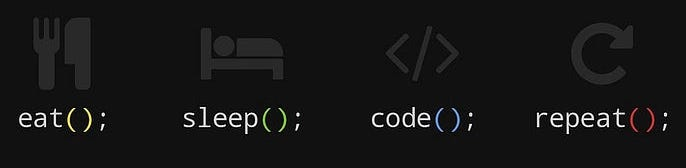

<h2>If you don’t take risks, you can’t create a future. </h2>


<!--  -->


###   About Me

```javascript
const Vuyani_Nxele = {
  pronouns: "he" | "him",
  Iam : ["Software Developer"],
  code: [Python, Java, C/C++, SQL],
  tools_&_tech: [Vscode, Android Studio, Gradle, Maven, Spring Framework, PostgreSQL, Linux, Git, Github Firesbase, SDL2, pytest],
  Experience: {
          Software_Developer: "American Tower Cooperation",
          Software_Developer_Intern: "We Think Code",
          Data_Science_Student: "Umuzi",
    },
  WorkedOn: {
          American_Tower_Cooperation: "Java, Spring Framework, Android Studio, Gradle, Maven, Firebase",
          We_Think_Code: "C/C++, SQL, Linux, Github, Git, SDL2",
          Data_Science: "Python, PostgreSQL, Pytest, TDD",
    },
}
```


<hr>
